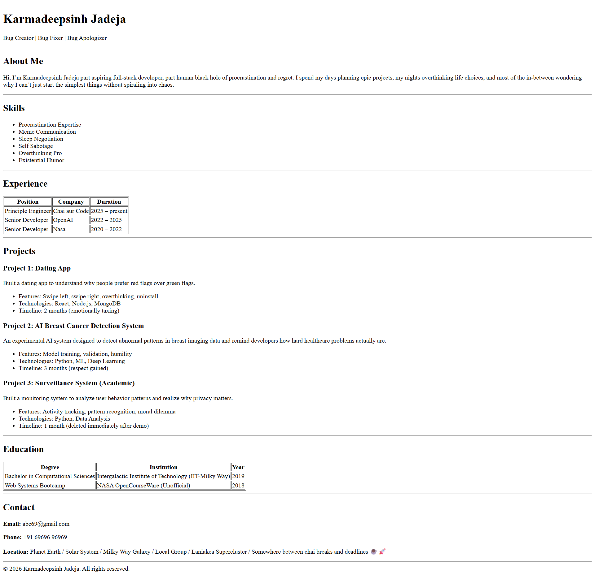

# Cohort Resume Assignment

## Assignment Overview
This assignment required creating a **personal resume** in **HTML** that is:  

- Semantic and accessible  
- Structured with `<header>`, `<main>`, `<section>`, `<article>`, `<footer>`  
- Includes all essential sections: About Me, Skills, Experience, Projects, Education, and Contact  
- Incorporates accessibility best practices (alt text, captions, scope attributes, ARIA labels)

---

## What’s Covered in My Submission
- **Semantic HTML**: Proper usage of headings (`<h1>` → `<h2>` → `<h3>`), sections, and articles  
- **Accessibility Enhancements**:  
  - `role="banner"` for header  
  - `scope="col"` for tables  
  - `aria-label` for projects  
- **Education Section**: Includes all academic details with proper table markup  

---

## Screenshot

---
